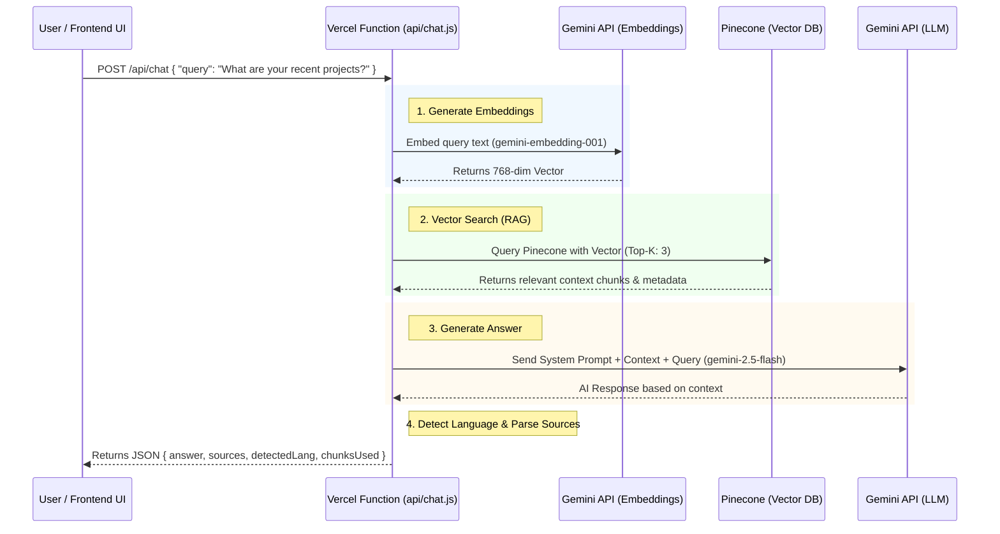

# Annai (案内) — Voice RAG Backend

Annai is a serverless, voice-enabled Retrieval-Augmented Generation (RAG) backend deployed on Vercel. It powers an intelligent, multilingual, and polite AI assistant for Chhayansh Porwal's engineering portfolio website.

This backend uses a **Zero-LangChain** approach, utilizing raw `fetch` for all API calls to ensure maximum performance, minimal cold-start times, and zero unnecessary dependencies.

## Features

- **Serverless Architecture**: Built as a Vercel Serverless Function (`api/chat.js`) for seamless scaling and low maintenance.
- **Retrieval-Augmented Generation (RAG)**: Connects to a Pinecone Vector Database to retrieve context from a custom knowledge base.
- **Google Gemini Integration**: 
  - `gemini-embedding-001` (768-dimensional) for fast and accurate text embeddings.
  - `gemini-2.5-flash` for high-speed, intelligent responses.
- **Multilingual Persona**: Annai automatically detects the user's language (English, Hindi, Japanese, etc.) and responds in the exact same language while maintaining a polite, professional, and warm female persona (e.g., using です/ます in Japanese or respectful आप in Hindi).
- **Voice-Optimized Responses**: Prompts are specifically engineered to produce natural, flowing sentences suitable for Text-to-Speech (TTS) reading, avoiding markdown formatting.
- **Language Detection Hint**: Automatically detects the language of the generated text to provide the frontend with the correct TTS voice configuration (e.g., `hi-IN`, `ja-JP`, `en-US`).

## Architecture & Workflow

The entire lifecycle of a single user request happens in a swift, serverless execution:



### Detailed Steps

1. **Receive User Query**: The frontend sends a `POST` request with the user's text query.
2. **Embed Query**: The text is sent to the Google Gemini Embeddings API (`gemini-embedding-001`) to generate a 768-dimensional vector representation.
3. **Retrieve Context**: The backend queries a Pinecone Vector Database using the vector to fetch the top 3 most relevant chunks of information from the portfolio knowledge base.
4. **Generate Response**: The retrieved context, the original question, and Annai's strict system prompt are sent to `gemini-2.5-flash`. The model generates an answer strictly based on the provided context.
5. **Analyze & Format**: The backend extracts source URLs from the Pinecone metadata and analyzes the generated text to provide a language hint (e.g., `en-US`, `ja-JP`) for the frontend's Text-to-Speech engine.
6. **Return Data**: The final JSON response is sent back to the client.

## API Endpoint Reference

### `POST /api/chat`

**Request Body:**
```json
{
  "query": "Tell me about your manga generation project."
}
```

**Response Example:**
```json
{
  "answer": "Chhayansh is working on an exciting project called Project Koma, which is an automated manga novel adaptation pipeline. It uses a Human-in-the-loop architecture with Gemini Flash and SDXL. Would you like to know more about the tech stack he used?",
  "sources": [
    {
      "name": "Project Koma",
      "url": "https://github.com/chhayanshporwal/project-koma"
    }
  ],
  "detectedLang": "en-US",
  "chunksUsed": 3
}
```

## Setup & Local Development

### Prerequisites

- Node.js >= 18
- A Vercel Account
- Google Gemini API Key
- Pinecone Account and Index

### 1. Clone the repository

```bash
git clone https://github.com/chhayanshporwal/voice-rag-backend.git
cd voice-rag-backend
```

*(Note: There are no `npm install` steps required since this uses a zero-dependency architecture utilizing the native Node.js `fetch` API).*

### 2. Environment Variables

Create a `.env` file in the root directory and add the following keys:

```env
GOOGLE_API_KEY=your_gemini_api_key
PINECONE_API_KEY=your_pinecone_api_key
PINECONE_INDEX=your_pinecone_index_name
```

### 3. Run locally

You can run this locally using the Vercel CLI:

```bash
npm i -g vercel
vercel dev
```

The API will be available at `http://localhost:3000/api/chat`.

## Cross-Origin Resource Sharing (CORS)

This backend is strictly configured to accept requests only from designated origins to prevent abuse. Current allowed origins:
- `https://chhayanshporwal.github.io`
- `http://localhost:4000`
- `http://127.0.0.1:4000`

If you are forking this for your own use, update the `ALLOWED_ORIGIN` constant and the `setCorsHeaders` function in `api/chat.js`, as well as the `vercel.json` configuration file.

## Why Zero-LangChain?

Many RAG implementations rely on heavy frameworks like LangChain or LlamaIndex. This project intentionally avoids them to:
1. **Reduce Cold Start Times**: Vercel Serverless functions need to boot up quickly. Removing heavy abstraction libraries cuts boot time significantly.
2. **Minimize Bundle Size**: The entire backend logic sits in a single, lightweight `chat.js` file (~200 lines of code).
3. **Enhance Transparency**: Using native `fetch` requests makes it crystal clear exactly what payloads are being sent to Google and Pinecone, making debugging straightforward.

## License

MIT License. Feel free to use this as a reference architecture for your own serverless RAG APIs.
