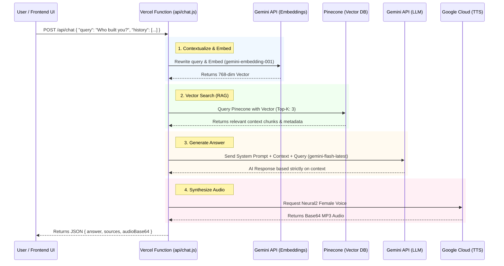

# Annai (案内) — Voice RAG Backend

Annai is a serverless, voice-enabled Retrieval-Augmented Generation (RAG) backend deployed on Vercel. It powers an intelligent, self-aware, and highly constrained AI assistant for Chhayansh Porwal's engineering portfolio website.

This backend uses a **Zero-LangChain** approach, utilizing raw `fetch` for all API calls to ensure maximum performance, minimal cold-start times, and zero unnecessary dependencies.

## Features

- **Serverless Architecture**: Built as a Vercel Serverless Function (`api/chat.js`) for seamless scaling and low maintenance.
- **Retrieval-Augmented Generation (RAG)**: Connects to a Pinecone Vector Database to retrieve context from a custom knowledge base.
- **Strictly Grounded LLM**: Uses `gemini-flash-latest` with rigid prompt engineering to guarantee zero hallucination. Annai only answers using the top chunks from Pinecone and explicitly rejects out-of-bounds questions.
- **Native TTS Pipeline**: Audio is synthesized exclusively via Google Cloud Text-to-Speech (Neural2 engine) to deliver a high-quality, professional voice with extremely low latency.
- **Conversational Memory**: Automatically manages chat history to contextualize pronouns and follow-up questions before hitting the vector database.

## Architecture & Workflow

The entire lifecycle of a single user request happens in a swift, serverless execution:



### Detailed Steps

1. **Receive Query & History**: The frontend sends the user's text query alongside the previous 6 conversation turns.
2. **Contextualize**: Gemini converts pronoun-heavy follow-up questions into standalone queries.
3. **Embed Query**: The standalone text is embedded into a 768-dimensional vector via `gemini-embedding-001`.
4. **Retrieve Context**: The backend queries a Pinecone database to fetch the top 3 most relevant chunks about Chhayansh's projects.
5. **Generate Response**: The retrieved context, question, and strict system prompt are sent to `gemini-flash-latest`.
6. **Synthesize Speech**: The generated text is routed to Google Cloud TTS for Neural2 audio synthesis.
7. **Return Payload**: The final JSON response containing the text answer, source citations, and Base64 audio is sent back to the client.

## API Endpoint Reference

### `POST /api/chat`

**Request Body:**
```json
{
  "query": "Who built you?",
  "history": []
}
```

**Response Example:**
```json
{
  "answer": "I was designed and engineered entirely by Chhayansh Porwal to act as his interactive virtual representative. My backend runs on a Vercel Serverless Architecture using Gemini 1.5 Flash.",
  "sources": [
    {
      "name": "Annai Voice-Enabled RAG Architecture",
      "url": "https://github.com/chhayanshporwal/voice-rag-backend.git",
      "detailedUrl": "/portfolio/voice-rag-assistant/"
    }
  ],
  "audioBase64": "//NExAAAAANIAAAAAExBTUUzLjEwMKqqqqqqqqqqqqqqqqqqqqqqqqqqqqqqqqqq..."
}
```

## Setup & Local Development

### Prerequisites

- Node.js >= 18
- A Vercel Account
- Google Gemini API Key
- Pinecone Account and Index
- Google Cloud Service Account (for TTS)

### Environment Variables

Create a `.env` file in the root directory:

```env
GOOGLE_API_KEY=your_gemini_api_key
PINECONE_API_KEY=your_pinecone_api_key
PINECONE_INDEX=your_pinecone_index_name
GOOGLE_CLOUD_TTS_API_KEY=your_google_cloud_tts_key
```

### Run locally

```bash
npm i -g vercel
vercel dev
```

The API will be available at `http://localhost:3000/api/chat`.

## Cross-Origin Resource Sharing (CORS)

This backend is strictly configured to accept requests only from designated origins:
- `https://chhayanshporwal.github.io`
- `http://localhost:4000`
- `http://127.0.0.1:4000`

## License

MIT License. Feel free to use this as a reference architecture for your own serverless RAG APIs.
